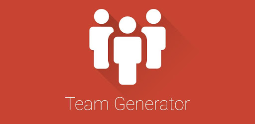

### Team Profile Generator
#

## This is a simple application that helps you create your team that consits of Engineers, Interns, and Managers. There are than corresponding HTML pages generated for your team. Below is an animated video that shows how to run the application and the results of running the application. 
##

## This application uses Inquirer, nodeJS, Fs, a HTMLRender and HTML 

# Built with

## Prerequistes

## Instructions
#
1.  Download Visual Studio code from https://code.visualstudio.com/download 
#
2. Download nodeJS compiler from https://nodejs.org/en/download/current/
#
4. Install the software
#
5. do a clone with https and download the source code
#
6. do a npm install
#
7. Launch the command prompt or if you have gitbash installed launch gitbash
#
7. Run node app.js
#
8. Follow the prompts in the command prompt or gitbash
#
## Note: If you get stuck watch the animated image
